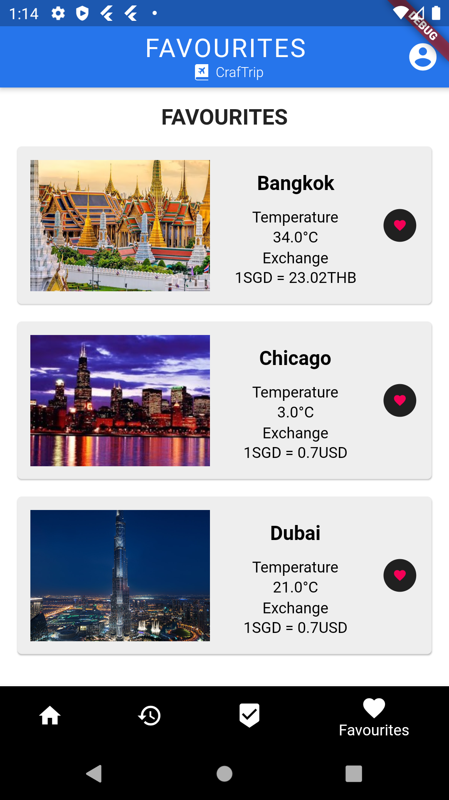
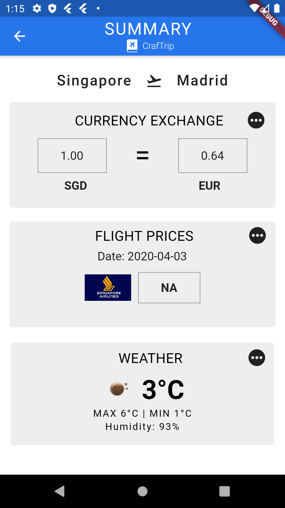

# CrafTrip

CrafTrip is a native iOS and Android travel application that provides an all in one platform to check currency exchange rates, weather forecasts and flight prices for a given destination. 

Watch the full demo video <a href= "https://www.youtube.com/watch?v=pfa3LyngCac&feature=youtu.be">here.</a> 

## Key Features

  </t>  </t>  

### Login/Sign Up
CrafTrip provides the functionality for users to Sign Up and Login to their inidivdual accounts. This authentication, achieved with FirebaseAuth, enables a personalised experience for every user. 

New users encounter a prompt to select a travel preference tag (e.g. cultural, coastal etc), and are shown a quick tutorial on how to use the application before proceeding to the application features. This preference tag may be altered later from user settings. 

### Browse Destinations 
Users may browse travel destinations and swipe right/left or favourite destinations as per their preferences. The user selected preference tag will determine the initial order of the travel destinations shown to the user. Consequently, the order of destinations displayed will be determined by the internal recommendation algorithm which uses the user's swipes history. 

The destinations data is remotely stored and accessed from Cloud Firestore. For any given destination, multiple API integration allows the user to view the following information: 

#### > View Flight Prices
Craftrip will obtain flight prices in real time for flights between a user’s choice of travel destination and Singapore on dates selected by the user.

#### > View Currency Exchange Rates
Craftrip will display the current exchange rate of the travel destinations relative to Singapore and be able to view the nearest money changers around Singapore.

#### > View Weather data
Craftrip will display the current weather at the travel destinations and weather forecast for the next 5 days.

### History (All swiped destinations)
This section allows the user to view all swiped destinations, irregardless of whether they were left or right swiped. For an accidentally left swiped destination, the user may reverse the action by selecting the Favourite button. This shall reassign the destination to the Favourites section. 

### Favourites (Right swiped destinations)
This section allows the user to view all right-swiped destinations. To remove a destination from Favourites, the user may reverse the action by unselecting the Favourite button. This shall reassign the destination to the History section. 

### Recommendations 
Craftrip will recommend to users travel destinations based on their past swipes to show them travel destinations they might be interested in. The internal algorithm also displays the calculated top travel tags preferred by the user. 

#### Recommendation algorithm 

<table>
  <tr>
    <th> History Destinations (Swiped) </th>
    <th> Remaining Destinations (Unswiped) </th>
  </tr>
  <tr>
   <td> 
     <ul>
      <li> Each user has a unique list of weights representing each bucket tag with an integer value (e.g. weights = [50, 40, 20, 30, 40, 0, 10, 25, 10]).
      <li> This list determines the weight of user's preference towards a specific travel tag. 
      <li> For every destination the user swiped/liked, weights will be updated with the destination's particular bucket tags.  
        + 0 for tag miss  
        + 3 for like  
        + 5 for user preferred tag
     </ul>
  </td>
    <td> 
      <ul>
        <li> Each destination contains a list of bucket tag boolean values (e.g. bucketTags = [1,0,0,1,1,0,0,1,1]). 
        <li> This list determines the travel tags a destination does or does not satisfy. 
        <li> Calculate score for each remaining destination, by summing all products of destination bucket boolean values with corresponding user preference weights.
        <li> Recommend destinations with highest scores, as a higher score indicates the user is more likely to visit that destination.
      </ul>
   </td>
	</tr>
</table>

## Documentation 

* Initial Dialog Map

* Conceptual Diagram

* Class Diagram

* System Architecture 

* <a href="https://github.com/anushadatta/CrafTrip/tree/master/documentation/diagrams/Sequence%20Diagrams"> Sequence Diagrams </a>
* <a href="https://github.com/anushadatta/CrafTrip/blob/master/documentation/Final%20Report.pdf"> Final Report </a>

## Authors 
* Anusha Datta
* Mehul Kumar 
* Amrita Ravishankar
* Clarita Chua
* Sarah Yeoh Sue Min 
* Jun Hong Lim
